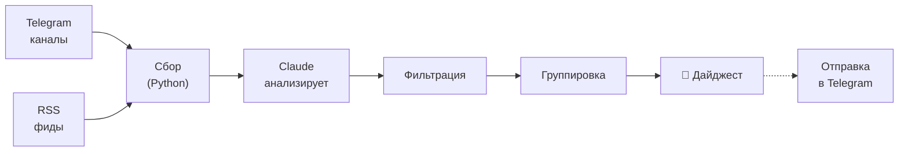
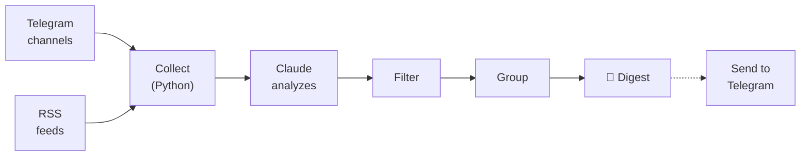

# news-digest-skill

Claude Code skill for generating AI news digests from Telegram channels and RSS feeds — directly in your terminal.

Скилл для Claude Code — собирает новости из Telegram-каналов и RSS, фильтрует шум и выдаёт структурированный дайджест.

---

## Русский

### Что это

Плагин для [Claude Code](https://claude.ai/claude-code), который добавляет команду `/digest`. Вы указываете источники (Telegram-каналы, RSS-ленты), а Claude сам собирает посты, убирает рекламу и повторы, группирует по темам и пишет краткую сводку.

Внешние AI API не нужны — Claude сам выступает фильтром и суммаризатором.

### Как это работает



### Команды

| Команда | Что делает |
|---------|------------|
| `/digest` | Сгенерировать дайджест |
| `/digest add @channel` | Добавить Telegram-канал |
| `/digest add https://...` | Добавить RSS-фид |
| `/digest remove @channel` | Удалить источник |
| `/digest sources` | Список источников |
| `/digest send` | Отправить дайджест в Telegram |
| `/digest setup` | Настроить Telegram-бота |

### Установка

```bash
git clone https://github.com/alxyrgin/news-digest-skill.git
cp -r news-digest-skill ~/.claude/skills/digest
```

После этого `/digest` доступен в Claude Code.

### Быстрый старт

```
/digest add @durov
/digest add @openai
/digest add https://habr.com/ru/rss/
/digest
```

### Пример вывода

```
📰 Дайджест за 17 марта 2025

3 источника · 42 поста · 6 в дайджесте

---

### 🤖 AI и машинное обучение

📌 Anthropic выпустила Claude 4.5 Opus — новая флагманская
модель с контекстом 1 млн токенов. Улучшено качество кода
и следование инструкциям.
@ai_newz

📌 Google DeepMind представила Gemini 2.5 Pro — модель
с нативным мультимодальным reasoning.
@tech_channel

---

### 🛠 Разработка и инструменты

📌 Docker Desktop 5.0 — переработанный интерфейс,
поддержка Wasm-контейнеров.
@devops_channel
```

Источники — кликабельные ссылки на `@канал` или `domain.com`.

### Отправка в Telegram

```
/digest setup    # одноразово: Bot Token + Chat ID
/digest send     # отправить дайджест
```

### Хранение данных

Всё локально в `~/.config/news-digest/`:

| Файл | Что внутри |
|------|------------|
| `sources.json` | Список источников |
| `config.json` | Токен бота, Chat ID |

Директория создаётся автоматически при первом запуске. Права доступа `700`/`600`.

### Структура

```
news-digest-skill/
├── SKILL.md               # Инструкции скилла
├── scripts/
│   ├── fetch_telegram.py   # Парсинг Telegram (HTTP)
│   ├── fetch_rss.py        # Парсинг RSS/Atom
│   └── send_telegram.py    # Отправка через Bot API
└── references/
    └── output_example.md   # Пример вывода
```

### Benchmark

Сравнение: Claude со скиллом vs Claude без скилла (3 теста):

| Метрика | Со скиллом | Без скилла | Разница |
|---------|-----------|------------|---------|
| Качество | 100% (13/13) | 54% (7/13) | **+46%** |
| Токены | 20,893 | 37,529 | **-44%** |
| Время | 65 сек | 102 сек | **1.6x** |

**Почему со скиллом лучше:**
- Предсказуемый формат вывода — каждый раз одинаковый
- Не тратит токены на исследование проекта
- Отказоустойчивый сбор — если один источник недоступен, остальные работают

### Ограничения

| Ограничение | Почему | Альтернатива |
|-------------|--------|--------------|
| Только публичные каналы | Парсинг через `t.me/s/` (HTTP) | [news-digest](https://github.com/alxyrgin/news-digest) — Telethon |
| Последние ~20 постов | Лимит публичной страницы Telegram | Полная версия собирает всё |
| Нет автосбора | Скилл запускается вручную | Полная версия — планировщик 24/7 |
| Нужен Python 3 | Скрипты парсинга | Обычно предустановлен |
| Только Claude Code | Skill API | — |

### Полная версия

Для приватных каналов, автоматического сбора и Telegram-бота:

**[github.com/alxyrgin/news-digest](https://github.com/alxyrgin/news-digest)** — Docker, Telethon, APScheduler, aiogram.

### Безопасность

- Валидация имён каналов (только `[a-zA-Z0-9_]`)
- Валидация URL (только `http`/`https`, без `file://`)
- Токен бота — через env-переменные или config с правами `600`
- SSL-верификация включена
- Защита от prompt injection через контент каналов

### Автор

**Александр Ярыгин** — [@alxyrgin](https://t.me/alxyrgin)

Telegram-канал **«AI для людей»** — AI-инструменты, автоматизация, практические кейсы.

### Лицензия

MIT — [LICENSE](LICENSE)

---

## English

### What is this

A [Claude Code](https://claude.ai/claude-code) plugin that adds the `/digest` command. You specify sources (Telegram channels, RSS feeds), and Claude collects posts, removes ads and duplicates, groups by topic, and writes a concise summary.

No external AI APIs needed — Claude itself is the filter and summarizer.

### How it works



### Commands

| Command | What it does |
|---------|-------------|
| `/digest` | Generate digest |
| `/digest add @channel` | Add Telegram channel |
| `/digest add https://...` | Add RSS feed |
| `/digest remove @channel` | Remove source |
| `/digest sources` | List sources |
| `/digest send` | Send digest to Telegram |
| `/digest setup` | Configure Telegram bot |

### Installation

```bash
git clone https://github.com/alxyrgin/news-digest-skill.git
cp -r news-digest-skill ~/.claude/skills/digest
```

The `/digest` command is available in Claude Code after this.

### Quick Start

```
/digest add @durov
/digest add @openai
/digest add https://news.ycombinator.com/rss
/digest
```

### Example Output

```
📰 Digest for March 17, 2025

3 sources · 42 posts · 6 in digest

---

### 🤖 AI & Machine Learning

📌 Anthropic released Claude 4.5 Opus — new flagship model
with 1M token context. Improved code quality and instruction
following.
@ai_newz

📌 Google DeepMind unveiled Gemini 2.5 Pro — native
multimodal reasoning model.
@tech_channel

---

### 🛠 Development & Tools

📌 Docker Desktop 5.0 — redesigned UI, native Wasm
container support.
@devops_channel
```

Sources are clickable links to `@channel` or `domain.com`.

### Sending to Telegram

```
/digest setup    # one-time: Bot Token + Chat ID
/digest send     # send the digest
```

### Data Storage

Everything is local in `~/.config/news-digest/`:

| File | Contents |
|------|----------|
| `sources.json` | Source list |
| `config.json` | Bot token, Chat ID |

Directory is created automatically on first run. Permissions `700`/`600`.

### Structure

```
news-digest-skill/
├── SKILL.md               # Skill instructions
├── scripts/
│   ├── fetch_telegram.py   # Telegram parser (HTTP)
│   ├── fetch_rss.py        # RSS/Atom parser
│   └── send_telegram.py    # Telegram Bot API sender
└── references/
    └── output_example.md   # Output example
```

### Benchmark

Comparison: Claude with skill vs Claude without skill (3 tests):

| Metric | With skill | Without | Delta |
|--------|-----------|---------|-------|
| Quality | 100% (13/13) | 54% (7/13) | **+46%** |
| Tokens | 20,893 | 37,529 | **-44%** |
| Time | 65 sec | 102 sec | **1.6x** |

**Why the skill is better:**
- Predictable output format every time
- Doesn't waste tokens exploring the project
- Fault-tolerant — if one source is down, the rest still work

### Limitations

| Limitation | Why | Alternative |
|------------|-----|-------------|
| Public channels only | Parses `t.me/s/` (HTTP) | [news-digest](https://github.com/alxyrgin/news-digest) — Telethon |
| Last ~20 posts | Telegram public page limit | Full version collects everything |
| No auto-collection | Skill runs on demand | Full version — 24/7 scheduler |
| Requires Python 3 | Parsing scripts | Usually pre-installed |
| Claude Code only | Skill API | — |

### Full Version

For private channels, automatic collection, and a Telegram bot:

**[github.com/alxyrgin/news-digest](https://github.com/alxyrgin/news-digest)** — Docker, Telethon, APScheduler, aiogram.

### Security

- Channel name validation (only `[a-zA-Z0-9_]`)
- URL validation (only `http`/`https`, no `file://`)
- Bot token — via env variables or config file with `600` permissions
- SSL verification enabled
- Prompt injection protection for source content

### Author

**Alexander Yarygin** — [@alxyrgin](https://t.me/alxyrgin)

Telegram channel **"AI for People"** — AI tools, automation, practical use cases.

### License

MIT — [LICENSE](LICENSE)
