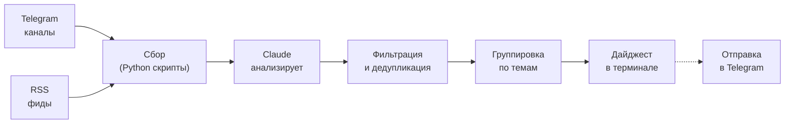
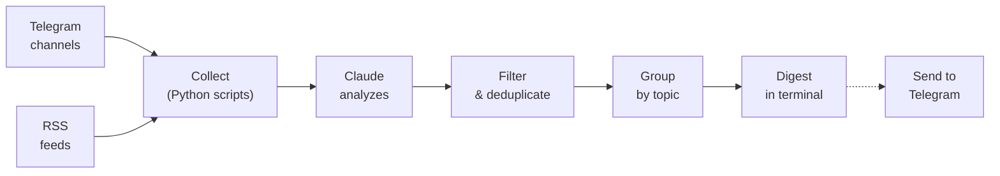

# news-digest-skill

Claude Code skill for generating AI news digests from Telegram channels and RSS feeds — directly in your terminal.

Скилл для Claude Code, который собирает новости из Telegram-каналов и RSS-лент и генерирует AI-дайджест прямо в терминале.

---

## Русский

### Что это

Claude Code skill — плагин, который добавляет команду `/digest` в Claude Code. Вы добавляете источники (Telegram-каналы и RSS), а Claude собирает посты, фильтрует шум, группирует по темам и выдаёт структурированный дайджест на русском языке.

Никаких внешних AI API не требуется — Claude сам выступает фильтром и суммаризатором.

### Как это работает



### Команды

| Команда | Описание |
|---------|----------|
| `/digest` | Сгенерировать дайджест из всех источников |
| `/digest add @channel` | Добавить Telegram-канал |
| `/digest add https://...` | Добавить RSS-фид |
| `/digest remove @channel` | Удалить источник |
| `/digest sources` | Показать список источников |
| `/digest send` | Сгенерировать и отправить в Telegram |
| `/digest setup` | Настроить Telegram-бота для отправки |

### Установка

```bash
# Клонировать репозиторий
git clone https://github.com/alxyrgin/news-digest-skill.git

# Скопировать в директорию скиллов Claude Code
cp -r news-digest-skill ~/.claude/skills/digest
```

После этого команда `/digest` станет доступна в Claude Code.

### Быстрый старт

```bash
# 1. Добавить источники
/digest add @durov
/digest add @openai
/digest add https://habr.com/ru/rss/

# 2. Посмотреть список
/digest sources

# 3. Сгенерировать дайджест
/digest
```

### Пример вывода

```markdown
# Дайджест за 17 марта 2025

## AI и машинное обучение
- **Anthropic выпустила Claude 4.5 Opus** — новая флагманская модель
  с контекстом 1 млн токенов. Улучшено качество кода и следование
  инструкциям. [-> источник](https://t.me/ai_newz/1234)

## Разработка и инструменты
- **Docker Desktop 5.0** — переработанный интерфейс, поддержка
  Wasm-контейнеров. [-> источник](https://t.me/devops_ch/890)

---
*Обработано: 5 источников, 42 поста -> 8 в дайджесте*
```

### Отправка в Telegram

Чтобы получать дайджест в Telegram, настройте бота:

```bash
# Одноразовая настройка
/digest setup
# Введите Bot Token от @BotFather и Chat ID от @userinfobot

# Отправка
/digest send
```

### Где хранятся данные

| Файл | Описание |
|------|----------|
| `~/.config/news-digest/sources.json` | Список источников |
| `~/.config/news-digest/config.json` | Настройки Telegram-бота |

Данные хранятся локально в `~/.config/news-digest/`. При первом запуске директория создаётся автоматически.

### Структура скилла

```
news-digest-skill/
├── SKILL.md              # Основной файл скилла
├── scripts/
│   ├── fetch_telegram.py  # Парсинг Telegram-каналов
│   ├── fetch_rss.py       # Парсинг RSS/Atom фидов
│   └── send_telegram.py   # Отправка в Telegram
└── references/
    └── output_example.md  # Пример формата вывода
```

### Benchmark

Результаты тестирования скилла (3 теста, сравнение со скиллом и без):

| Метрика | Со скиллом | Без скилла | Дельта |
|---------|-----------|------------|--------|
| Pass rate | 100% (13/13) | 54% (7/13) | **+46%** |
| Токены (среднее) | 20,893 | 37,529 | **-44%** |
| Время (среднее) | 64.9 сек | 102.2 сек | **1.6x быстрее** |

Скилл обеспечивает:
- **Предсказуемый формат** — одинаковый вывод каждый раз
- **Экономию токенов** — не тратит время на исследование проекта
- **Стабильную работу** — отказоустойчивый сбор из всех источников

### Ограничения

- **Только публичные Telegram-каналы** — скилл парсит `t.me/s/channel` (публичная веб-страница). Приватные каналы и чаты не поддерживаются. Для приватных каналов нужен полноценный бот с Telethon — см. [news-digest](https://github.com/alxyrgin/news-digest)
- **Нет Telethon** — скилл не использует Telegram Client API, работает только через HTTP
- **Последние ~20 постов** — Telegram показывает ограниченное количество постов на публичной странице
- **Нет фонового сбора** — скилл запускается вручную, нет планировщика. Для автоматических ежедневных дайджестов используйте [news-digest](https://github.com/alxyrgin/news-digest)
- **Требуется Python 3** — для работы скриптов парсинга
- **Требуется Claude Code** — скилл работает только в Claude Code CLI

### Полная версия

Если нужен автоматический сбор из приватных каналов, планировщик и Telegram-бот — используйте полноценный проект:

[github.com/alxyrgin/news-digest](https://github.com/alxyrgin/news-digest)

### Автор

**Александр Ярыгин** — [@alxyrgin](https://t.me/alxyrgin)

Telegram-канал **«AI для людей»** — про AI-инструменты, автоматизацию и практические кейсы.

### Лицензия

MIT License. Подробности в файле [LICENSE](LICENSE).

---

## English

### What is this

A Claude Code skill that adds the `/digest` command to Claude Code. You add sources (Telegram channels and RSS feeds), and Claude collects posts, filters noise, groups by topic, and produces a structured digest.

No external AI APIs needed — Claude itself acts as the filter and summarizer.

### How it works



### Commands

| Command | Description |
|---------|-------------|
| `/digest` | Generate digest from all sources |
| `/digest add @channel` | Add a Telegram channel |
| `/digest add https://...` | Add an RSS feed |
| `/digest remove @channel` | Remove a source |
| `/digest sources` | List all sources |
| `/digest send` | Generate and send to Telegram |
| `/digest setup` | Configure Telegram bot for delivery |

### Installation

```bash
# Clone the repository
git clone https://github.com/alxyrgin/news-digest-skill.git

# Copy to Claude Code skills directory
cp -r news-digest-skill ~/.claude/skills/digest
```

The `/digest` command will be available in Claude Code after this.

### Quick Start

```bash
# 1. Add sources
/digest add @durov
/digest add @openai
/digest add https://news.ycombinator.com/rss

# 2. Check your sources
/digest sources

# 3. Generate digest
/digest
```

### Example Output

```markdown
# Digest for March 17, 2025

## AI & Machine Learning
- **Anthropic released Claude 4.5 Opus** — new flagship model with 1M
  token context window. Improved code quality and instruction
  following. [-> source](https://t.me/ai_newz/1234)

## Development & Tools
- **Docker Desktop 5.0** — redesigned UI, native Wasm container
  support. [-> source](https://t.me/devops_ch/890)

---
*Processed: 5 sources, 42 posts -> 8 in digest*
```

### Sending to Telegram

To receive digests in Telegram, configure a bot:

```bash
# One-time setup
/digest setup
# Enter Bot Token from @BotFather and Chat ID from @userinfobot

# Send digest
/digest send
```

### Data Storage

| File | Description |
|------|-------------|
| `~/.config/news-digest/sources.json` | Source list |
| `~/.config/news-digest/config.json` | Telegram bot settings |

Data is stored locally in `~/.config/news-digest/`. The directory is created automatically on first run.

### Skill Structure

```
news-digest-skill/
├── SKILL.md              # Main skill file
├── scripts/
│   ├── fetch_telegram.py  # Telegram channel parser
│   ├── fetch_rss.py       # RSS/Atom feed parser
│   └── send_telegram.py   # Telegram message sender
└── references/
    └── output_example.md  # Output format example
```

### Benchmark

Skill test results (3 tests, with-skill vs without-skill comparison):

| Metric | With skill | Without skill | Delta |
|--------|-----------|---------------|-------|
| Pass rate | 100% (13/13) | 54% (7/13) | **+46%** |
| Tokens (avg) | 20,893 | 37,529 | **-44%** |
| Time (avg) | 64.9 sec | 102.2 sec | **1.6x faster** |

The skill provides:
- **Predictable output format** — consistent results every time
- **Token efficiency** — doesn't waste time exploring the project
- **Reliable collection** — graceful error handling for all sources

### Limitations

- **Public Telegram channels only** — the skill parses `t.me/s/channel` (public web preview). Private channels and chats are not supported. For private channels, use the full bot with Telethon — see [news-digest](https://github.com/alxyrgin/news-digest)
- **No Telethon** — the skill does not use Telegram Client API, HTTP only
- **Last ~20 posts** — Telegram shows a limited number of posts on the public page
- **No background collection** — the skill runs on demand, no scheduler. For automatic daily digests, use [news-digest](https://github.com/alxyrgin/news-digest)
- **Requires Python 3** — for parsing scripts
- **Requires Claude Code** — the skill only works in Claude Code CLI

### Full Version

If you need automatic collection from private channels, a scheduler, and a Telegram bot — use the full project:

[github.com/alxyrgin/news-digest](https://github.com/alxyrgin/news-digest)

### Author

**Alexander Yarygin** — [@alxyrgin](https://t.me/alxyrgin)

Telegram channel **"AI for People"** — AI tools, automation, and practical use cases.

### License

MIT License. See [LICENSE](LICENSE) for details.
